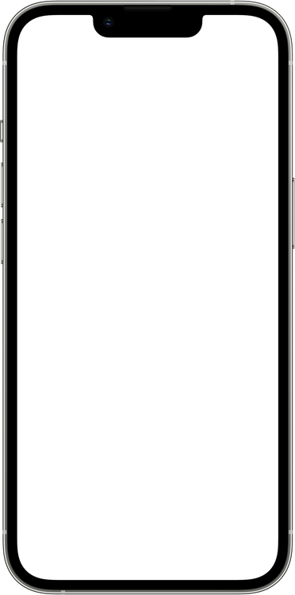
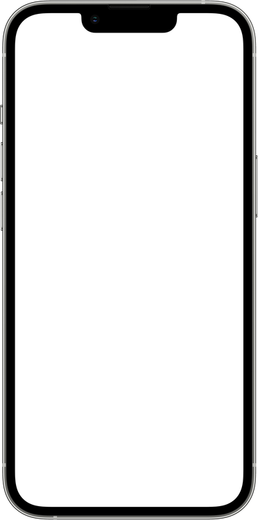

# Asset Catalog

> Generated by `bun run manifest` — do not edit by hand.
> Machine-readable metadata lives in [`img/manifest.json`](./img/manifest.json)
> (also served at `https://marquelmedia.github.io/assets/img/manifest.json`).

23 shared assets. Previews use repo-relative paths and render on GitHub.

| Preview | Path | Type | Dimensions | Size | Hash |
|---|---|---|---|---|---|
|  | `img/app-icon.svg` | svg | 117×117 | 0.2 KB | `84292315fe21` |
|  | `img/ash.gif` | gif | 100×100 · 4f | 15.1 KB | `e2f3565d8713` |
|  | `img/ash.webp` | webp | 100×100 · 4f | 14.0 KB | `c56b78a8939b` |
|  | `img/devices/iphone.png` | png | 372×750 | 30.3 KB | `7d16edd9d4eb` |
|  | `img/devices/iphone.webp` | webp | 372×750 | 16.5 KB | `50f258c1a68a` |
|  | `img/glass.png` | png | 1×1 | 0.1 KB | `3eb10792d1f0` |
|  | `img/icon.svg` | svg | 117×117 | 0.2 KB | `84292315fe21` |
|  | `img/logo-alt.svg` | svg | 1024×403 | 0.2 KB | `fd3481e2c47b` |
|  | `img/logo.png` | png | 1024×403 | 6.2 KB | `37ce3ffa0caa` |
|  | `img/logo.svg` | svg | 1024×1024 | 0.2 KB | `8a59ebdb05b5` |
|  | `img/logo.webp` | webp | 1024×403 | 1.8 KB | `86290c2d1b4a` |
|  | `img/mark.svg` | svg | 117×117 | 0.2 KB | `84292315fe21` |
|  | `img/no.svg` | svg | 1×1 | 0.1 KB | `e4273e2490f8` |
|  | `img/pixel.png` | png | 2×2 | 0.1 KB | `08a5a93e82e2` |
|  | `img/placeholder-product.png` | png | 600×600 | 6.0 KB | `360a772f616b` |
|  | `img/placeholder-product.webp` | webp | 600×600 | 2.1 KB | `601bb68b0d9a` |
|  | `img/rotate.png` | png | 300×300 | 4.3 KB | `87522575223f` |
|  | `img/rotate.webp` | webp | 300×300 | 1.7 KB | `176c90eba607` |
|  | `img/stores/app-store.png` | png | 160×59 | 4.5 KB | `e27fe3189eba` |
|  | `img/stores/app-store.webp` | webp | 160×59 | 2.6 KB | `56566539cd4b` |
|  | `img/stores/play-store.png` | png | 160×59 | 5.2 KB | `5689aef356f9` |
|  | `img/stores/play-store.webp` | webp | 160×59 | 3.7 KB | `ce68381e5736` |
|  | `img/type.svg` | svg | 117×1 | 0.2 KB | `465b54c3f5c5` |
